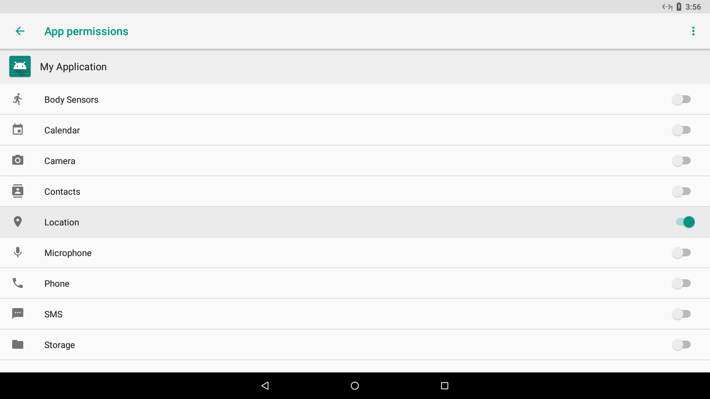
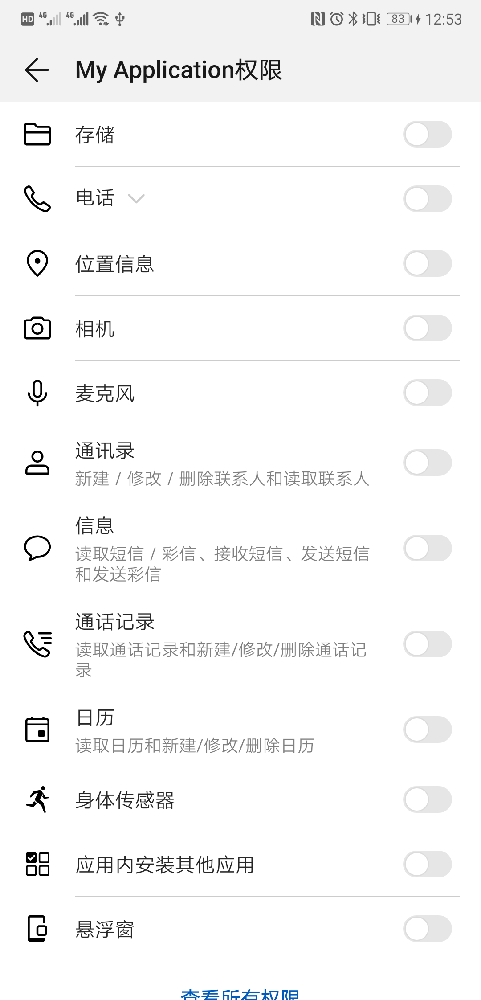

## Android 权限管理中的虚拟数据来源分析

### 研究方法

基于[Android Developer 官方开发文档](https://developer.android.google.cn/reference/android/Manifest.permission.html)，截至api level 28，过滤掉已废弃权限及系统权限，获取应用程序可申请的权限如下：

```
    <uses-permission android:name="android.permission.ACCEPT_HANDOVER" />
    <uses-permission android:name="android.permission.ACCESS_BACKGROUND_LOCATION" />
    <uses-permission android:name="android.permission.ACCESS_COARSE_LOCATION" />
    <uses-permission android:name="android.permission.ACCESS_FINE_LOCATION" />
    <uses-permission android:name="android.permission.ACCESS_LOCATION_EXTRA_COMMANDS" />
    <uses-permission android:name="android.permission.ACCESS_MEDIA_LOCATION" />
    <uses-permission android:name="android.permission.ACCESS_NETWORK_STATE" />
    <uses-permission android:name="android.permission.ACCESS_NOTIFICATION_POLICY" />
    <uses-permission android:name="android.permission.ACCESS_WIFI_STATE" />
    <uses-permission android:name="android.permission.ACTIVITY_RECOGNITION" />
    <uses-permission android:name="android.permission.ADD_VOICEMAIL" />
    <uses-permission android:name="android.permission.ANSWER_PHONE_CALLS" />
    <uses-permission android:name="android.permission.BIND_CALL_REDIRECTION_SERVICE" />
    <uses-permission android:name="android.permission.BIND_CARRIER_MESSAGING_CLIENT_SERVICE" />
    <uses-permission android:name="android.permission.BLUETOOTH" />
    <uses-permission android:name="android.permission.BLUETOOTH_ADMIN" />
    <uses-permission android:name="android.permission.BODY_SENSORS" />
    <uses-permission android:name="android.permission.BROADCAST_STICKY" />
    <uses-permission android:name="android.permission.CALL_COMPANION_APP" />
    <uses-permission android:name="android.permission.CALL_PHONE" />
    <uses-permission android:name="android.permission.CAMERA" />
    <uses-permission android:name="android.permission.CHANGE_NETWORK_STATE" />
    <uses-permission android:name="android.permission.CHANGE_WIFI_MULTICAST_STATE" />
    <uses-permission android:name="android.permission.CHANGE_WIFI_STATE" />
    <uses-permission android:name="android.permission.DISABLE_KEYGUARD" />
    <uses-permission android:name="android.permission.EXPAND_STATUS_BAR" />
    <uses-permission android:name="android.permission.FOREGROUND_SERVICE" />
    <uses-permission android:name="android.permission.GET_ACCOUNTS" />
    <uses-permission android:name="android.permission.GET_PACKAGE_SIZE" />
    <uses-permission android:name="android.permission.INSTALL_SHORTCUT" />
    <uses-permission android:name="android.permission.INTERNET" />
    <uses-permission android:name="android.permission.KILL_BACKGROUND_PROCESSES" />
    <uses-permission android:name="android.permission.MANAGE_OWN_CALLS" />
    <uses-permission android:name="android.permission.MODIFY_AUDIO_SETTINGS" />
    <uses-permission android:name="android.permission.NFC" />
    <uses-permission android:name="android.permission.NFC_TRANSACTION_EVENT" />
    <uses-permission android:name="android.permission.PROCESS_OUTGOING_CALLS" />
    <uses-permission android:name="android.permission.READ_CALENDAR" />
    <uses-permission android:name="android.permission.READ_CALL_LOG" />
    <uses-permission android:name="android.permission.READ_CONTACTS" />
    <uses-permission android:name="android.permission.READ_EXTERNAL_STORAGE" />
    <uses-permission android:name="android.permission.READ_PHONE_NUMBERS" />
    <uses-permission android:name="android.permission.READ_PHONE_STATE" />
    <uses-permission android:name="android.permission.READ_SMS" />
    <uses-permission android:name="android.permission.READ_SYNC_SETTINGS" />
    <uses-permission android:name="android.permission.READ_SYNC_STATS" />
    <uses-permission android:name="android.permission.READ_VOICEMAIL" />
    <uses-permission android:name="android.permission.RECEIVE_BOOT_COMPLETED" />
    <uses-permission android:name="android.permission.RECEIVE_MMS" />
    <uses-permission android:name="android.permission.RECEIVE_SMS" />
    <uses-permission android:name="android.permission.RECEIVE_WAP_PUSH" />
    <uses-permission android:name="android.permission.RECORD_AUDIO" />
    <uses-permission android:name="android.permission.REORDER_TASKS" />
    <uses-permission android:name="android.permission.REQUEST_COMPANION_RUN_IN_BACKGROUND" />
    <uses-permission android:name="android.permission.REQUEST_COMPANION_USE_DATA_IN_BACKGROUND" />
    <uses-permission android:name="android.permission.REQUEST_DELETE_PACKAGES" />
    <uses-permission android:name="android.permission.REQUEST_IGNORE_BATTERY_OPTIMIZATIONS" />
    <uses-permission android:name="android.permission.REQUEST_INSTALL_PACKAGES" />
    <uses-permission android:name="android.permission.REQUEST_PASSWORD_COMPLEXITY" />
    <uses-permission android:name="android.permission.SEND_SMS" />
    <uses-permission android:name="android.permission.SET_ALARM" />
    <uses-permission android:name="android.permission.SET_WALLPAPER" />
    <uses-permission android:name="android.permission.SET_WALLPAPER_HINTS" />
    <uses-permission android:name="android.permission.SMS_FINANCIAL_TRANSACTIONS" />
    <uses-permission android:name="android.permission.START_VIEW_PERMISSION_USAGE" />
    <uses-permission android:name="android.permission.SYSTEM_ALERT_WINDOW" />
    <uses-permission android:name="android.permission.TRANSMIT_IR" />
    <uses-permission android:name="android.permission.UNINSTALL_SHORTCUT" />
    <uses-permission android:name="android.permission.USE_BIOMETRIC" />
    <uses-permission android:name="android.permission.USE_FULL_SCREEN_INTENT" />
    <uses-permission android:name="android.permission.USE_SIP" />
    <uses-permission android:name="android.permission.VIBRATE" />
    <uses-permission android:name="android.permission.WAKE_LOCK" />
    <uses-permission android:name="android.permission.WRITE_CALENDAR" />
    <uses-permission android:name="android.permission.WRITE_CALL_LOG" />
    <uses-permission android:name="android.permission.WRITE_CONTACTS" />
    <uses-permission android:name="android.permission.WRITE_EXTERNAL_STORAGE" />
    <uses-permission android:name="android.permission.WRITE_SYNC_SETTINGS" />
    <uses-permission android:name="android.permission.WRITE_VOICEMAIL" />
```

编写测试应用程序，在AndroidManifest.xml中申请上述全部权限，在Android Settings里查看到的运行时权限为9个：

* Body Sensors
* Calendar
* Camera
* Contacts
* Location
* Microphone
* Phone
* SMS
* Storage



部分设备厂商实际上会对AOSP的运行时权限进行扩展和细化，以华为为例，增加了悬浮窗（授权应用可以悬浮显示在全部应用的最上层）、应用内安装其他应用等运行时权限。



Body Sensors
* BODY_SENSRS

Calendar
* READ_CALENDAR
* WRITE_CALENDAR

Camera
* CAMERA

Contacts
* READ_CALL_LOG
* READ_CONTACTS
* WRITE_CONTACTS
* WRITE_CALL_LOG

Location
* ACCESS_BACKGROUND_LOCATION
* ACCESS_COARSE_LOCATION
* ACCESS_FINE_LOCATIONf
* ACCESS_LOCATION_EXTRA_COMMANDS
* ACCESS_MEDIA_LOCATION

Microphone
* RECORD_AUDIO

Phone
* ACCEPT_HANDOVER
* ADD_VOICEMAIL
* ANSWER_PHONE_CALLS
* CALL_PHONE
* READ_PHONE_NUMBERS
* READ_PHONE_STATE
* USE_SIP
* READ_VOICEMAIL
* WRITE_VOICEMAIL

SMS
* READ_SMS
* RECEIVE_MMS
* RECEIVE_SMS
* RECEIVE_WAP_PUSH
* SEND_SMS

Storage
* READ_EXTERNAL_STORAGE
* WRITE_EXTERNAL_STORAGE

Unclassified
* ACCESS_NETWORK_STATE
* ACCESS_NOTIFICATION_POLICY
* ACCESS_WIFI_STATE
* ACTIVITY_RECOGNITION
* BIND_CALL_REDIRECTION_SERVICE
* BIND_CARRIER_MESSAGING_CLIENT_SERVICE
* BLUETOOTH
* BLUETOOTH_ADMIN
* BROADCAST_STICKY
* CALL_COMPANION_APP
* CHANGE_NETWORK_STATE
* CHANGE_WIFI_MULTICAST_STATE
* CHANGE_WIFI_STATE
* DISABLE_KEYGUARD
* EXPAND_STATUS_BAR
* FOREGROUND_SERVICE
* GET_ACCOUNTS
* GET_PACKAGE_SIZE
* INSTALL_SHORTCUT
* INTERNET
* KILL_BACKGROUND_PROCESSES
* MANAGE_OWN_CALLS
* MODIFY_AUDIO_SETTINGS
* NFC
* NFC_TRANSACTION_EVENT
* PROCESS_OUTGOING_CALLS
* READ_SYNC_SETTINGS
* READ_SYNC_STATS
* RECEIVE_BOOT_COMPLETED
* REORDER_TASKS
* REQUEST_COMPANION_RUN_IN_BACKGROUND
* REQUEST_COMPANION_USE_DATA_IN_BACKGROUND
* REQUEST_DELETE_PACKAGES
* REQUEST_IGNORE_BATTERY_OPTIMIZATIONS
* REQUEST_INSTALL_PACKAGES
* REQUEST_PASSWORD_COMPLEXITY
* SET_ALARM
* SET_WALLPAPER
* SET_WALLPAPER_HINTS
* SMS_FINANCIAL_TRANSACTIONS
* START_VIEW_PERMISSION_USAGE
* SYSTEM_ALERT_WINDOW
* TRANSMIT_IR
* UNINSTALL_SHORTCUT
* USE_BIOMETRIC
* USE_FULL_SCREEN_INTENT
* VIBRATE
* WAKE_LOCK
* WRITE_SYNC_SETTINGS

### 虚拟数据来源

适合虚拟HAL
* Camera
* Microphone
* Phone （拨打接听电话、获取电话状态、获取本机号码）
* SMS （发送接收SMS MMS）

适合虚拟Provider
* Calendar
* Contacts
* Location
* Phone （读取通话记录）
* SMS （读取SMS MMS）

待定
* Storage
* Body Sensors
