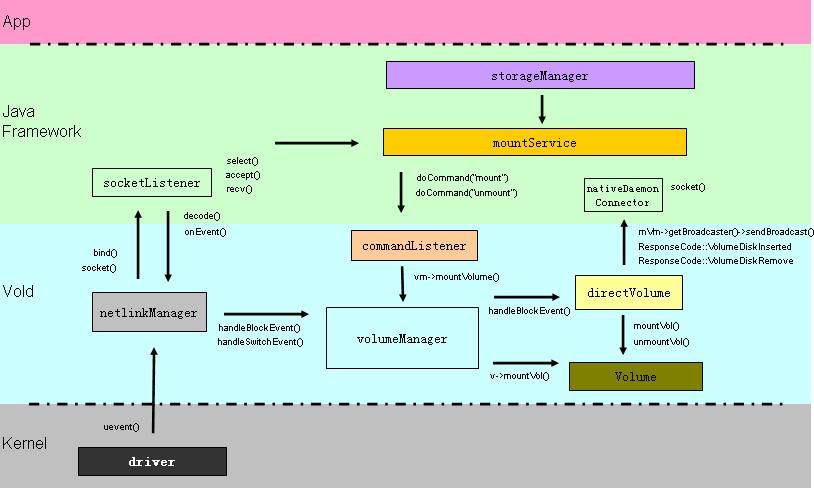

# openthos系统支持移动存储多分区的设计文档
内容：

- 项目简介
- 功能需求
- 项目进展
- 设计实现

## 项目简介
Android系统使用vold服务对Ｕ盘等移动存储设备进行管理，默认不支持多分区的识别挂载。

openthos系统实现了对Ｕ盘等移动存储设备的多分区识别挂载功能。

当前开发人员: 肖络元

## 功能需求
- 实现对Ｕ盘等移动存储设备的多分区识别挂载功能。

## 项目进展
序号|名称 | 备注|时间阶段|说明
------------- | ------------- | ------------- |-------------| -------------
1|U盘识别挂载多分区|passed|201703|功能完成 肖络元

## 设计实现
### Android Vold情况概述
目前Android Vold支持的文件系统格式包括:
`ext2,ext3,ext4,fat32,fat16,extfat,iso9660`

不支持:`NTFS  `

不支持在一块移动存储设备上识别挂载多个分区。

### Android Vold设计实现

Vold工作机制如下：
- vold进程：管理和控制Android平台外部存储设备，包括SD插拨、挂载、卸载、格式化等；vold进程接收来自内核的外部设备消息。
- Vold接收来自内核的事件，通过netlink机制。<br>
Netlink 是一种特殊的 socket；<br>
Netlink 是一种在内核与用户应用间进行双向数据传输的非常好的方式，用户态应用使用标准的socket API 就可以使用 netlink 提供的强大功能；<br>
Netlink是一种异步通信机制，在内核与用户态应用之间传递的消息保存在socket缓存队列中；<br>
内核通过Netlink发送uEvent格式消息给用户空间程序；外部设备发生变化，Kernel发送uevent消息。

Vold框架图如下


默认情况一个U盘只有一个分区,在代码中是指volume;
/storage/usb0中usb0即是volume的label,如果存在多个分区那么当有一个分区成功挂载到/storage/usb0上时,其他所有的分区都放弃挂载;  
这种是不合理的设计,在AndroidM已经修复,不再使用固定的挂载点而是根据分区的Label动态创建挂载点;

修改思路:
修改挂载点位动态设置;

修改的部分为:
主要在系统底层vold，可能还包括framework层的MountService相关业务逻辑。

### Vold初始化分析
**main.cpp**

在开始时会新建以下几个类的单例:  

- VolumeManager:  
作为Vold的中控函数,所有的上传,下发事件都会经过VolumeManager;  

- NetlinkManager:  
监测kernel上传的uevent事件,其中我们只关注disk和part的add,remove事件  
它启动时是建立一个socket来并勇socket来构建了一个NetlinkHandler,最终调用VolumeManager->handleBlockEvent事件:
```
NetlinkListener onDataAvailable
      |^           |
NetlinkHandler  onevent
```
- CommandListener:  
监听framework下发的命令事件,例如volume命令中常见操作:mount,umount,format  

**Volume的概念**

Volume传统翻译为'卷',是一个可辨认的数据存储（storage）单元,可能是可移动磁盘或者U盘设备;在这里
一般是指这两样设备,从这个角度来看,vold的管理是以物理存储单元为单位的,而我们的分区则纯粹是逻辑上的;  
在lollipop-x86中管理物理设备,而不是管理分区的;

其中commandlistener的继承关系,所以sendBroadcast的动作是经过SocketListener中的方法来做的,其他类似;
```
SocketListener
      |^
FrameworkListener
      |^
CommandListener
```
process_config中的操作:
读取/fstab.android_x86_64中的文件
```
none	/cache		tmpfs	nosuid,nodev,noatime	defaults
blk_device mount_point fstype     flags:更多阅读fs_mgr_read_fstab
auto	/storage/usb0	vfat	defaults	wait,noemulatedsd,voldmanaged=usb0:auto
auto	/storage/usb1	vfat	defaults	wait,noemulatedsd,voldmanaged=usb1:auto
auto	/storage/usb2	vfat	defaults	wait,noemulatedsd,voldmanaged=usb2:auto
auto	/storage/usb3	vfat	defaults	wait,noemulatedsd,voldmanaged=usb3:auto
解读:所有的设备都可以挂载在/storage/usb0s上,默认的fstype是vfat格式;
flag:这个volume的label标示位usb0,非模拟的u盘
auto	/storage/usb0	vfat	defaults	wait,noemulatedsd,voldmanaged=usb0:auto
```
根据上面的配置文件生成4个volume的实例,以备在插入U盘时,U盘的信息和状态都在一个volume中管理;

### U盘插入事件
VolumeManager::handleBlockEvent:调用在初始化时构建的volume来进行依次处理,如果有一个可以处理则结束循环;

下面我们省略AutoVolume的方法(它里面的方法太少而且它是DirectoVolume的子类),只关注DirectVolume的方法;  

接收到disk add事件->查询如下目录下新增节点->读取新增节点的/devices下链接->交给DirectVolume继续处理  
```
"/sys/bus/mmc/drivers/mmcblk",      // MMC block device
"/sys/bus/usb/drivers/usb-storage", // USB Mass Storage
"/sys/bus/usb/drivers/rts5139",     // Realtek RTS5139 USB card reader
```
DirectVolume:handleBlockEvent  

 1.处理disk事件  
创建/dev/block/vold/8:32节点  
读取disk的分区数,保存到Volume中  

 2.处理partition事件  
尝试挂载分区(等待所有的分区都保存到partition中,然后尝试挨个挂载;如果一个挂载成功则退出)  

3.挂载处理
检查挂载点是否可用  
获取分区的文件系统类型  
文件系统类型检查纠错  
文件系统挂载动作  

vold层的事件很简单,对于分区的支持相对容易;

### vold和framework层的交互
与vold对应的接口是MountService

MountService初始化:  

1.读取下面的配置文件,并保存到StorageVolume[]中,从这里看framework和vold对应都是以volume为
管理单位的;
```
<StorageList xmlns:android="http://schemas.android.com/apk/res/android">
    <!-- internal emulated storage -->
    <storage
        android:storageDescription="@string/storage_internal"
        android:primary="true"
        android:emulated="true"
        android:mtpReserve="100" />
    <storage
        android:mountPoint="/storage/sdcard1"
        android:storageDescription="@string/storage_sd_card"
        android:removable="true"
        android:maxFileSize="4096" />
    <storage
        android:mountPoint="/storage/usb0"
        android:storageDescription="@string/storage_usb"
        android:removable="true"
        android:maxFileSize="4096" />
    <storage
        android:mountPoint="/storage/usb1"
        android:storageDescription="@string/storage_usb"
        android:removable="true"
        android:maxFileSize="4096" />
    <storage
        android:mountPoint="/storage/usb2"
        android:storageDescription="@string/storage_usb"
        android:removable="true"
        android:maxFileSize="4096" />
    <storage
        android:mountPoint="/storage/usb3"
        android:storageDescription="@string/storage_usb"
        android:removable="true"
        android:maxFileSize="4096" />
</StorageList>
```
2.创建一些线程来处理事件  

NativeDaemonConnector:和vold的socket连接,接收消息,下发命令  
HandlerThread:处理内部的handler事件  
MountServiceHandler:处理和外部的service事件  
注册了监听USB事件的广播接收  
中间还有obb文件系统的事情


### 多分区支持的设计
1.对Volume挂载点的拓展

默认Ｕ盘设备单分区模式`usb0 usb1 usb2`，拓展成多分区模式`usb0_0 usb0_1 usb0_2 usb1_0 usb1_1 usb1_2`；

修改了`DirectVolume::getMountpoint()`函数，实现根据U盘分区情况动态分配挂载点名称；

2.对挂载操作的拓展

挂载操作主要在`Volume::mountVol()`函数。

内容包括扫描设备node，扫描U盘分区数目，获取分区文件系统类型，对分区进行挂载操作，U盘设备状态实时修改；

3.对卸载操作的拓展

移动设备支持了多分区挂载，必然需要对多分区卸载进行支持。

修改函数`Volume::doUnmount()`,多分区卸载操作如下：
```
    n = getDeviceNodes((dev_t *) &deviceNodes, 16);
    if (!n) {
       SLOGE("Failed to get device nodes (%s)\n", strerror(errno));
    }else{
       for (i = 1; i < n; i++) {
               char devicePath[255];

           sprintf(devicePath, "/dev/block/vold/%d:%d", major(deviceNodes[i]),
                           minor(deviceNodes[i]));

           SLOGI("Unmounting the volume (%s)\n", devicePath);

           if (doUnmount(getMountpoint(i), force) != 0) {
                   SLOGE("Failed to unmount %s (%s)", devicePath, strerror(errno));
                   continue;
           }
       }
    }
```
### 可能存在的问题
Android 5.1和Android 8.1的Vold服务变动较大，如果需要把5.1的U盘多分区支持功能移植到8.1，并不方便于移植。


